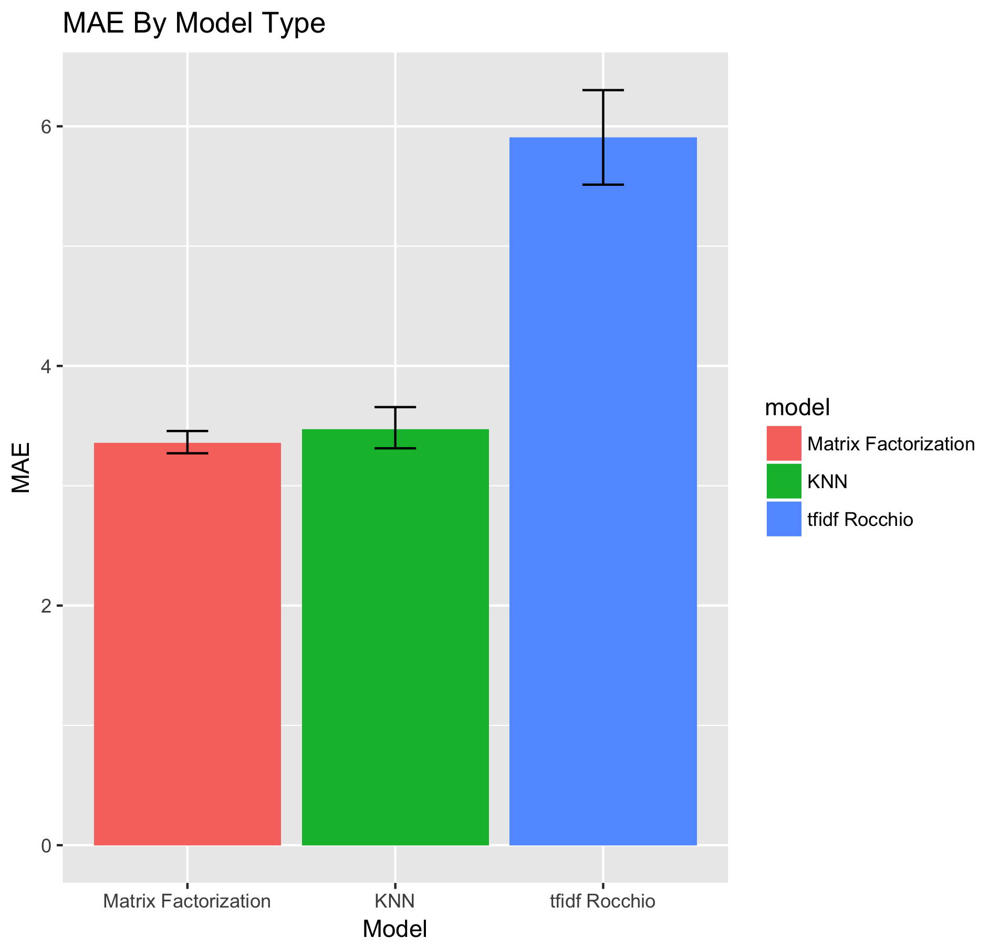

# CSC-575
Information Retrieval - Final Project - Winter 2017 - Scott Page

# Introduction
This project explores 3 different methods of predicting user rankings of jokes based on data provided at http://eigentaste.berkeley.edu/dataset/. (The data folder of the Repo Contains the working copy of jokes and user ratings.) 

# Demo and walk through
Check out the youtube for a demo run and other conversations on the program. https://youtu.be/6Twmvd9UrLA

# Quick Start

1. Open RStudio
2. Open Project -> CSC-575.Rproj
3. Packrat will hopefully install needed Libraries -> See packrat/packrat.lock for used lib's if in doubt
4. Open do.R, Select all, and Run
5. Read and rate first 10 jokes
6. Get recommended and unrecommended jokes through the 3 ranking systems explored

# Ranking Systems Explored
## Non Negative Matrix Factorization with KNN For Rapid Predictions
  Non Negative Matrix Factorization is a method by which both users and items can be clustered based on latent attributes. In a Non Negative Matrix Factorization problem we attempt to find matrix's W & H such that W*H approximate the original matrix A. Generally, W & H are of low rank vs A, and based on validation testing (using functions in analyze.R) we believe that rank 5 provides the best out of sample MAE performance. 
  In order to fit matrix W & H we use the NNMF function in the NNLM library with k = 5, and L1 regularization of both W & H of 1e-03 (approximated through cross validation). The NNMF function seeks an optimal W & H through a gradient decent process attempting to seek minimal MSE with respect to know values of the original matrix A containing users and ratings. Using the learned W & H matrix's we are able to approximate the unrated user - Joke ratings.
  Finally, since the NNMF process is generally time consuming, we perform predictions of new users / ratings using KNN with respect to the current user's ratings and the learned W*H matrix. This is the exact same process as the User - Rating KNN as described below, with the exception that the data being searched for near neighbors is densely filled in through the NNMF process.
  
Extra detail: Since the users rate jokes -10 to 10, we had to apply a shift of 10 to the values to ensure non negative ratings. This shift was removed prior to applying KNN to find optimal new user's potential ratings of jokes.

## User - Rating KNN
  User - Rating KNN is a process of collaborative filtering where a given user looks up similar users by joke ratings, and uses the average of those neighbors ratings to fill in unknown joke ratings. (This process was established to perform best with k = 6) To be more specific the employed KNN process computes cosign similarities between the new users and the existing users ratings using matrix operations. These similarity scores are then used to identify the closes neighbors who have rated an unknown joke. The predicted value of the unknown joke's rating is mean corrected (delta between target user and neighbor mean ratings), and weighted by the cosign similarity. 
  
## User - Rocchio Rating - TFIDF
  User - Rocchio Rating - TFIDF process focus's on fitting to the content of the joke vs the entity of the joke (See User - Rating KNN). In this process, users ratings of jokes are multiplied through the TFIDF weights to form the query for the user. Further, taking a page out of Rocchio's book we limit the weight of negative ratings to 1/4 of the full rating. In this way each user's query focus's more heavily on the content of jokes that were liked vs deweighting the content of jokes that were not liked. This process is applied to each training user, converting their original joke ratings into a Rocchio rating weighted sum of TFIDF scores of the joke content.
  Once the users ratings have been transformed into the Rocchio Rating TFIDF space, we perform KNN look up to find similar users based on cosign similarity (Optimal k was found to be 1).  With the now known similarity scores we are able to transfer back into the original User - Rating space, and compute the hypothetical scores users will give to each joke based on the neighbors.
  
### Text Mining Details
Joke's HTML files were mined to produce TFIDF weights (using TM Library and gsub). Prior to weighting, data was cleaned including:

* Removal of HTML
* Lower Case
* Removal of Punctuation
* Removal of Numbers
* Removal of English Stop words
* White space Removal
* Stemming via SnowballC

Finally, many sparse terms were removed from document term matrix. 
  
# Performance Review
  In 8 fold cross validation of the models Non Negative Matrix Factorization had lower MAE that the other two methods. This is likely attributable to NNMF's ability to take into account both user and joke latent features, and form a dense matrix for the KNN search.
  Following NNMF, User - Rating KNN performed nearly as well most likely errors were due to sparseness of the training matrix.
  Finally, the User - Rocchio Rating - TFIDF method performed substantially worse than the other two approaches. This is likely a representation that the content of the joke's wasn't a strong indicator of user's preference for / against them.

